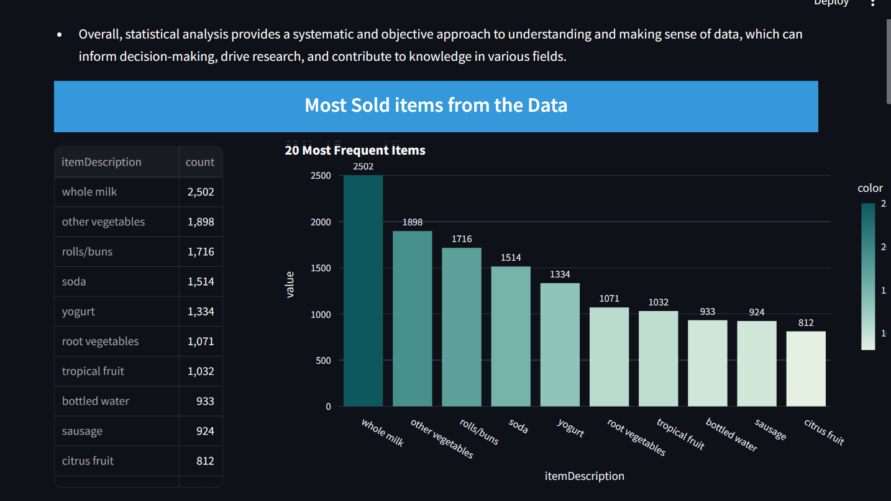
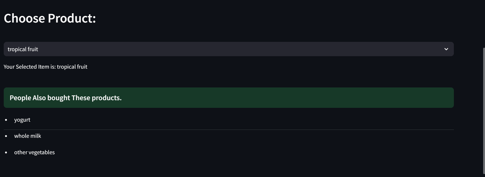

# 🛒 Market Basket Analysis Using Recommendation System

This project analyzes customer purchase data to find product association rules using the Apriori algorithm. It generates itemsets and suggests product recommendations based on frequently bought-together items.

---

## 📌 Objective

To identify item associations in a transactional dataset and suggest products to customers using **Market Basket Analysis**. The goal is to enhance customer experience and drive sales using product recommendation techniques.

---

## 🧠 Key Concepts

- **Market Basket Analysis**
- **Association Rule Mining**
- **Apriori Algorithm**
- **Product Recommendation System**
- **Frequent Itemsets**

---

## 🛠️ Technologies Used

- 🐍 Python
- 📊 Pandas
- 📈 Matplotlib
- 📦 mlxtend (for Apriori & Association Rules)
- 🧪 Jupyter Notebook

---

## 🚀 How to Run

1. **Clone the repository:**

    ```bash
    git clone https://github.com/teja2003555/Market-Basket-Analysis.git
    cd Market-Basket-Analysis

## 📸 Screenshots

### 🔹 Dashboard


### 🔹 Recommendation using apriri 


### 🔹 Cart Recommendation

